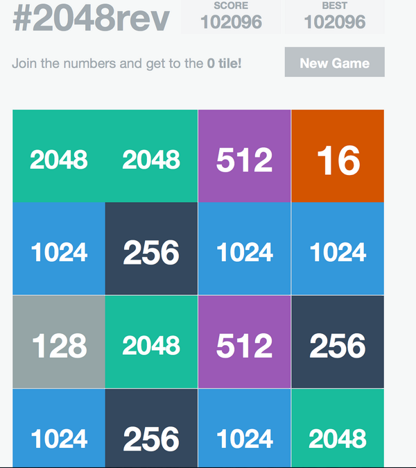

# 2048 Reverse edition with Flat colors
This is just a reversed version of the <a href="http://gabrielecirulli.com" target="_blank">Gabriele Cirulli's</a> <a href="http://git.io/2048">2048</a>

[You can try out the game here](http://rakeshkatti.github.io/2048/)

Made for fun! All credits goes to the following people.
<a href="http://git.io/2048">2048</a> by <a href="http://gabrielecirulli.com" target="_blank">Gabriele Cirulli.</a>
<a href="https://itunes.apple.com/us/app/1024!/id823499224" target="_blank">1024 by Veewo Studio</a>  
<a href="http://asherv.com/threes/" target="_blank">Threes by Asher Vollmer</a>  
